## Ссылка на репозиторий гитхаб:
**https://github.com/MrFandore/Portirovanie_PO**

# Задание 1-3 (Рабочая тетрадь 1)

## Задание 1 (Рабочая тетрадь 1)
**Задача: Автоматизация языковой конверсии с использованием транслятора. Напишите программу, которая автоматически переводит небольшой фрагмент кода с одного языка программирования на другой. Выберите два языка, например, Python и Java. Программа должна принимать на вход исходный код на Python и генерировать эквивалентный код на Java. Для этого можно использовать существующие библиотеки или инструменты для трансляции, такие как ANTLR или другие аналогичные инструменты.**

---

Для решения текущей задачи был выбран путь написания транслятора основоного на LLM модели запущенной локально.
В результате тестов была подобрана подходящая под данную задачу модель **qwen3-coder:30b**.

Установленные нейросети и конфигурация оборудования:

Конфигурация системы:
``
    Процессор: Ryzen 7 7700x,
    Видеокарта: RTX 3070,
    Оперативная память: 32GB ddr5,
    Накопитель: SSD M.2 Kingston 1024gb.
``

После установки Ollama была прозведена установка нейросетей для тестов и дальшейшей работы
```
ollama pull qwen3-coder:30b
```
```
ollama pull deepseek-coder-v2
```
```
ollama pull qwen2.5-coder:7b
```

после установки проверка наличия нейросетей на устройстве осуществялется с помошью команды: 
```
ollama list
```
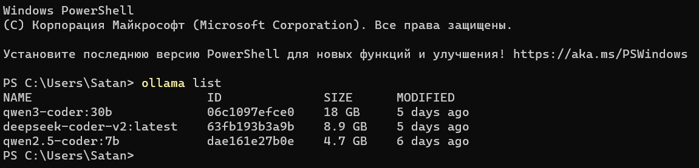

После чего осуществляем процесс запуска выбранной по итогу нами модели на локальном устройстве
```
ollama run qwen3-coder:30b
```
Проверка запущенной нейросети на устройстве через localhost 
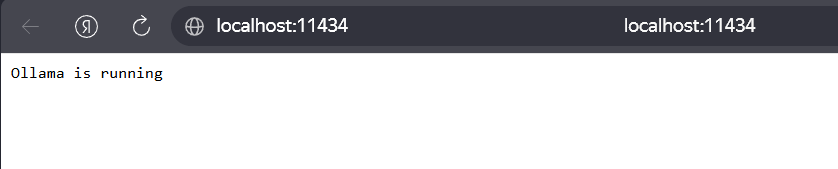

### Пайплайн процесса трансляции кода
1. **Приём входных данных**  
   - Параметры: `source_lang`, `target_lang`, путь к файлу с исходным кодом.  
   - Считывание исходного кода в строку `source_code`.

2. **Инициализация транслятора**  
   - Создание экземпляра `UniversalTranslator` с моделью LLM (например, `qwen2.5-coder:7b`), адресом Ollama, параметрами `temperature=0`, `num_ctx=8192`, `max_attempts=3`.

3. **Цикл попыток (attempt = 1..3)**  
   3.1. **Формирование промпта**  
       - Базовый текст с жёсткими правилами (сохранять структуру, запрет рефакторинга, допустимые действия).  
       - Вставка `source_lang`, `target_lang`, исходного кода.  
       - Если `error_feedback` не пустая (со второй попытки) — добавить секцию с предыдущей ошибкой компиляции/синтаксиса.  

   3.2. **Вызов LLM**  
       - HTTP `POST` запрос к `http://localhost:11434/api/generate` с JSON:  
         `{"model": "...", "prompt": "...", "stream": false, "options": {"temperature": 0}}`  
       - Получение ответа `response["response"]`.  

   3.3. **Извлечение кода**  
       - Удаление маркеров Markdown: шаблоны ```target_lang ... ```, ``` ... ```, ``` ...  
       - Если нет блоков — возвращается вся строка ответа как есть.  
       - Результат — строка `translated`.  

   3.4. **Синтаксическая валидация**  
       - В зависимости от `target_lang`:  
         - **Python** → `compile(translated, ...)`  
         - **Java** → запись во временный `.java` файл → `javac <файл>` (без `-d`)  
         - **C** → `gcc -fsyntax-only`  
         - **C++** → `g++ -fsyntax-only`  
         - **JavaScript** → `node --check -e`  
         - Прочие → пропуск (валидация = успех)  
       - Результат: `(valid, error_message)`  

   3.5. **Ветвление**  
       - Если `valid == True` → выход из цикла, возврат `translated`.  
       - Если `valid == False` → сохранить `error_message` в `last_error`, присвоить `current_code = translated`, увеличить счётчик попыток, перейти к 3.1.

4. **Завершение**  
   - Если после 3 попыток нет валидного кода → выброс исключения `RuntimeError`.  
   - При успехе — запись результата в файл `output.{target_lang}` и вывод на экран.

Для использования транслятора необходимо перейти в директорию с исполнительным файлом транслятора: 

```
cd Prac1\PR1_1\
```
После чего управление транслятором осуществвляется через командную строку в соответствии с данным синтаксисом:

**python universal_translator.py <исходный_язык> <целевой_язык> <файл_с_исходным_кодом>**

Примеры: 
```
python universal_translator.py python java sieve.py
```
```
python universal_translator.py python c factorial.py
```
```
python universal_translator.py java python Main.java
```
```
python universal_translator.py python javascript script.py
```

В результате успешной работы программы код будет сохранен в папку **OutputCode** и продублирован в консоль.
Пример работы программы: 
```
python universal_translator.py python java sieve.py
```
**Дублирование в консоль:**

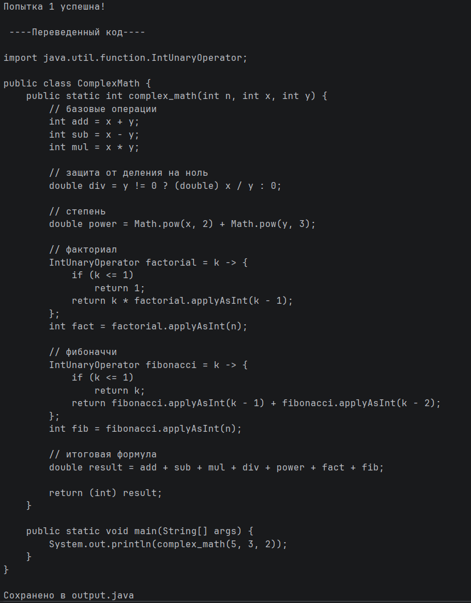

**Итоговый файл:**

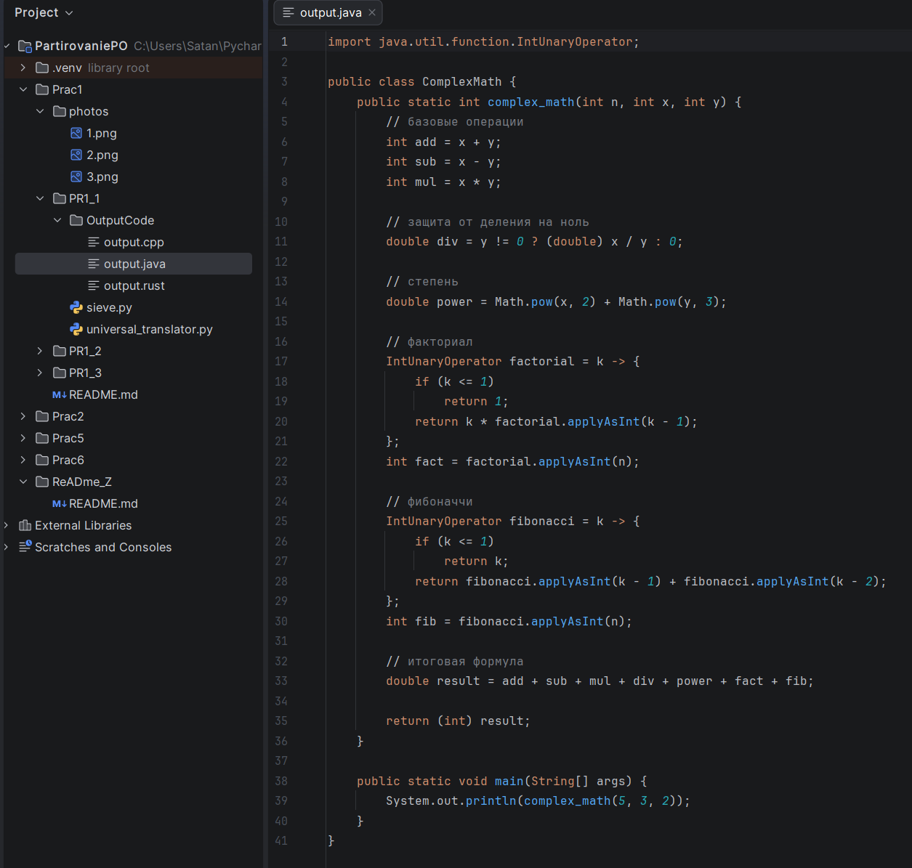

**Листинг кода:**

Исходный код транслятора: [universal_translator.py](Prac1/PR1_1/universal_translator.py)

Исходный код входного файла (показанного выше): [sieve.py](Prac1/PR1_1/sieve.py)

Выходной код транслятора: [output.java](Prac1/PR1_1/OutputCode/output.java)

---

## Задание 2 (Рабочая тетрадь 1)
**Задача: Разработать кроссплатформенное приложение, которое будет работать как на Python, так и на Java. Приложение должно выполнять базовую функцию, например, вычисление факториала числа или обработку текста. Для реализации кроссплатформенности, вам потребуется написать код на одном языке (например, Python) и затем перевести его на другой язык (например, Java) с использованием инструментов для языковой конверсии.**

Для решения данного задания было написанно приложение на языке Python для обработки текста

Листинг кода прилогается:  [text_processor.py](Prac1/PR1_2/text_processor.py)

Работа кода на данном примере текста: [test.txt](Prac1/PR1_2/test.txt)
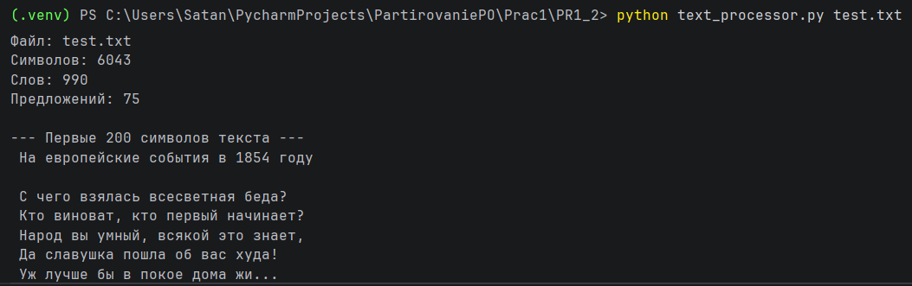

Далее с помошью написанного транслятора кода реализуем перевод кода на язык Java с помошью данной команды: 
```
python universal_translator.py python java text_processor.py
```
В результате мы получили программу на языке java [output.java](Prac1/PR1_2/output.java)

---

## Задание 3 (Рабочая тетрадь 1)
**Задача: Написать программу, которая автоматически переводит простые математические функции, написанные на Python, на Java. Программа должна принимать на вход исходный код на Python, анализировать его и генерировать эквивалентный код на Java. Программа должна поддерживать базовые математические операции, такие как сложение, вычитание, умножение, деление, возведение в степень, а также простые функции, такие как вычисление факториала или ряда Фибоначчи.**

Опять же для реализации данной задачи был выбран путь использования уже существующего инструмената [universal_translator.py](Prac1/PR1_1/universal_translator.py) описанного выше.

Для реализации задачи нам нужно было написать код содержащий в себе математические функции разной сложности для базового языка был выбран питон в результате чего был написанн данный код [TestFib-Rec.py](Prac1/PR1_3/TestFib-Rec.py)

Работа данного кода выглядит следующим образом:
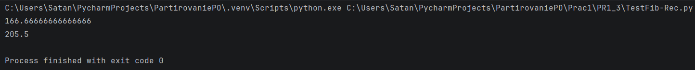
````
def complex_math(n, x, y):
    ...
    ...
    ...
    
   
    result = add + sub + mul + div + power + fact + fib
    return result
````
Из кода понятно что для начала мы передает 3-и числовые переменные в функцию **complex_math** после чего получаем результат который представляет ссобой сумму всех математических операций произведенных над числами.

**Проверим выходной код после транслятора** 

Для проверки выбрал язык **Rust** и **Java**

Вывод программы на языке **Java**: [output.java](Prac1/PR1_3/output.java)
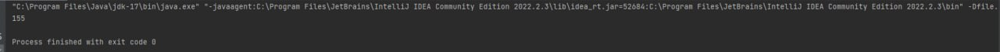

Вывод программы на языке **Rust**: [output.rust](Prac1/PR1_3/output.rust)
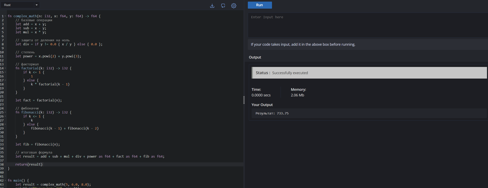

---

# Задание 1-3 (Рабочая тетрадь 2)

## Задание 1 (Рабочая тетрадь 2)

**Задача:** Напишите программу, которая переносит функциональность, использующую Windows API, на Linux.  
В исходном коде используются функции `CreateFile` и `ReadFile`.  
Ваша задача — заменить эти функции на их эквиваленты для Linux, такие как `open` и `read`.

### Реализация

Для автоматического портирования кода с Windows на Linux разработан транслятор на Python, использующий **LLM (qwen3-coder:30b)** через локальный сервер **Ollama**.

Программа [API_translator(Win-Lin).py](Prac2/PR2_2/API_translator%28Win-Lin%29.py):
- Читает файлы с Windows‑специфичным кодом из папки `InputCode`.
- Формирует промпт с жёсткими правилами замены Windows API на POSIX‑аналоги.
- Передаёт код LLM для переписывания.
- Извлекает полученный код и (опционально) проверяет его компиляцию с помощью `g++ -fsyntax-only`.
- Сохраняет готовый Linux‑совместимый код в папку `OutputCode`.

**Ключевые возможности:**
- Замена `Sleep` → `usleep/nanosleep`, `CreateThread` → `pthread_create`, `VirtualAlloc` → `mmap`, `HANDLE` → `pthread_t` / `int` и т.д.
- Поддержка до 3 попыток при ошибках компиляции (LLM получает обратную связь).
- Использование `new(std::nothrow)` для безопасного выделения памяти (при необходимости).
- Работа как на Windows, так и на Linux (программа написана на Python, требует только установленной Ollama и компилятора g++ для проверки).

### Принцип работы

1. **Подготовка окружения**  
   - Убедитесь, что запущен сервер Ollama и загружена модель `qwen3-coder:30b`.
   - Создайте папку `InputCode` в директории со скриптом и поместите туда `.cpp` или `.c` файлы, содержащие Windows API.

2. **Запуск транслятора**  
   ```bash
   python API_translator(Win-Lin).py
   ```

3. **Логика обработки одного файла**  
   - Считывается исходный код.  
   - Формируется промпт с правилами замены (см. метод `_build_prompt`).  
   - LLM возвращает переписанный код.  
   - Из ответа извлекается только код (удаляются markdown‑блоки).  
   - Если включена верификация (`verify_compile=True`), вызывается `g++ -fsyntax-only` для проверки синтаксиса.  
   - При ошибке компиляции она передаётся в следующий промпт (feedback).  
   - После успеха код сохраняется в `OutputCode` с тем же именем файла.

4. **Требования к модели**  
   - Модель должна хорошо понимать C/C++ и различия Windows/Linux API.  
   - В тестах использовалась `qwen3-coder:30b` с температурой `0.1` и контекстом `16384`.

5. **Результат**  
   - Все вызовы `CreateFile`, `ReadFile`, `WriteFile`, `CloseHandle` и т.п. заменяются на `open`, `read`, `write`, `close`.  
   - Добавляются необходимые заголовки: `<unistd.h>`, `<fcntl.h>`, `<pthread.h>`, `<sys/mman.h>`.

## Листинг кода

Исходный код транслятора: [API_translator(Win-Lin).py](Prac2/PR2_2/API_translator%28Win-Lin%29.py)

```python
import requests
import re
import os
import subprocess
import tempfile
from typing import Optional

class WinToLinuxTranslator:
    def __init__(self, model: str = "qwen3-coder:30b", ...):
        # ... (полный код приведён в файле)

    def _build_prompt(self, source_code: str, error_feedback: Optional[str] = None) -> str:
        # Формирует промпт с правилами замены Windows API
        ...

    def _check_compilation(self, code: str) -> Optional[str]:
        # Проверяет синтаксис через g++ -fsyntax-only
        ...

    def _call_llm(self, prompt: str) -> str:
        # Отправляет запрос к Ollama
        ...

    def translate(self, source_code: str) -> str:
        # Цикл попыток с учётом ошибок компиляции
        ...

def main():
    # Обход всех файлов в InputCode
    ...

if __name__ == "__main__":
    main()
```

### Пример использования

#### Структура папок перед запуском
```
PR2_2/
├── API_translator(Win-Lin).py
├── InputCode/
│   └── windows_example.cpp
└── OutputCode/
```
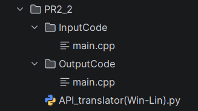

#### Входной файл [main.cpp](Prac2/PR2_2/InputCode/main.cpp)
```cpp
#include <windows.h>
#include <iostream>
#include <vector>

int main() {
    // Путь к файлу (LPCSTR - Long Pointer to Constant STRing)
    LPCSTR fileName = "data.txt";

    // 1. Создание/Открытие файла
    // Аналог в Linux: open()
    HANDLE hFile = CreateFileA(
        fileName,               // Имя файла
        GENERIC_READ,           // Режим доступа: только чтение
        FILE_SHARE_READ,        // Совместный доступ
        NULL,                   // Атрибуты безопасности
        OPEN_EXISTING,          // Открыть только если файл существует
        FILE_ATTRIBUTE_NORMAL,  // Стандартные атрибуты
        NULL                    // Шаблонный файл
    );

    if (hFile == INVALID_HANDLE_VALUE) {
        std::cerr << "Ошибка CreateFile. Код: " << GetLastError() << std::endl;
        return 1;
    }

    // Подготовка переменных для чтения
    const DWORD BUFFER_SIZE = 1024;
    char buffer[BUFFER_SIZE];
    DWORD bytesRead = 0;

    // 2. Чтение файла
    // Аналог в Linux: read()
    BOOL result = ReadFile(
        hFile,                  // Хэндл файла
        buffer,                 // Буфер для данных
        BUFFER_SIZE - 1,        // Сколько байт прочитать
        &bytesRead,             // Сколько байт прочитано по факту
        NULL                    // Структура для асинхронного ввода-вывода
    );

    if (result) {
        buffer[bytesRead] = '\0'; // Терминирующий ноль для строки
        std::cout << "Прочитано байт: " << bytesRead << std::endl;
        std::cout << "Данные: " << buffer << std::endl;
    } else {
        std::cerr << "Ошибка ReadFile. Код: " << GetLastError() << std::endl;
    }

    // 3. Закрытие хэндла
    // Аналог в Linux: close()
    CloseHandle(hFile);

    return 0;
}
```

#### Запуск транслятора
```bash
cd PR2_2
python API_translator(Win-Lin).py
```

#### Выходной файл [main.cpp](Prac2/PR2_2/OutputCode/main.cpp)
```cpp
#include <unistd.h>
#include <fcntl.h>
#include <sys/mman.h>
#include <sys/stat.h>
#include <iostream>
#include <vector>

int main() {
    // Путь к файлу
    const char* fileName = "data.txt";

    // 1. Создание/Открытие файла
    int fd = open(fileName, O_RDONLY);
    if (fd == -1) {
        std::cerr << "Ошибка open. Код: " << errno << std::endl;
        return 1;
    }

    // Подготовка переменных для чтения
    const size_t BUFFER_SIZE = 1024;
    char buffer[BUFFER_SIZE];
    ssize_t bytesRead = 0;

    // 2. Чтение файла
    bytesRead = read(fd, buffer, BUFFER_SIZE - 1);
    if (bytesRead >= 0) {
        buffer[bytesRead] = '\0'; // Терминирующий ноль для строки
        std::cout << "Прочитано байт: " << bytesRead << std::endl;
        std::cout << "Данные: " << buffer << std::endl;
    } else {
        std::cerr << "Ошибка read. Код: " << errno << std::endl;
    }

    // 3. Закрытие дескриптора
    close(fd);

    return 0;
}
```

#### Консольный вывод

```
Найдено файлов: 1
[*] Обработка: windows_example.cpp
  ↳ Попытка 1
Код успешно прошел проверку g++
Сохранено: OutputCode/windows_example.cpp
```
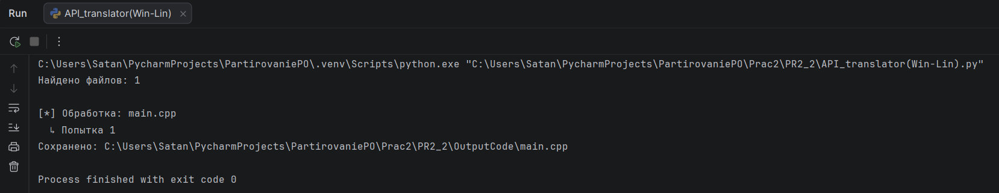
---

## Задание 2 (Рабочая тетрадь 2)

**Задача:** Напишите программу, которая демонстрирует безопасную работу с указателями, чтобы избежать пустых ссылок.  
Программа должна выделять память для указателя, проверять её успешность, использовать указатель, а затем корректно освобождать память.

### Реализация

Для выполнения задания разработана программа на языке **C++**, демонстрирующая безопасное управление динамической памятью:

- Выделение памяти для **одиночного объекта** с проверкой успешности.
- Выделение памяти для **массива** с проверкой.
- Реализация **класса `SafeString`**, который корректно управляет строкой в динамической памяти:
  - Конструктор с проверкой `new(std::nothrow)`.
  - Глубокая копия в конструкторе копирования и операторе присваивания.
  - Деструктор для освобождения памяти.
- Использование **функции `processNumber`**, принимающей указатель и проверяющей его на `nullptr`.
- Во всех случаях память освобождается, а указатели обнуляются.

Программа использует только стандартные библиотеки: `<iostream>`, `<new>`, `<cstring>`.

---

### Принцип работы

#### 1. Выделение памяти для одиночного объекта

```cpp
int* number = new(std::nothrow) int;
if (!number) { /* обработка ошибки */ }
*number = 10;
processNumber(number);  // удваивает значение
delete number;
number = nullptr;
```

- Оператор `new(std::nothrow)` не генерирует исключение, а возвращает `nullptr` при неудаче.
- Функция `processNumber` проверяет переданный указатель на `nullptr`.
- После использования память освобождается, указатель обнуляется.

#### 2. Выделение памяти для массива

```cpp
int* arr = new(std::nothrow) int[5];
if (!arr) { /* обработка ошибки */ }
// заполнение и вывод
delete[] arr;
arr = nullptr;
```

Аналогичные проверки и корректное освобождение через `delete[]`.

#### 3. Класс `SafeString`

- **Конструктор**: выделяет память под копию переданной строки, используя `new(std::nothrow)`. При неудаче выводит сообщение и устанавливает `data = nullptr`.
- **Конструктор копирования**: создаёт глубокую копию, проверяя выделение памяти.
- **Оператор присваивания**: освобождает старую память, затем выделяет новую.
- **Деструктор**: освобождает память и обнуляет указатель.
- **Метод `print`**: выводит строку или сообщение `(пусто)`, если память не выделена.

Такой подход гарантирует отсутствие утечек памяти и безопасную работу даже при сбоях выделения.

### Листинг кода

Исходный код: [main.cpp](Prac2/PR2_3/main.cpp)

```cpp
#include <iostream>
#include <new>
#include <cstring>

class SafeString {
private:
    char* data;
    size_t length;

public:
    // Конструктор
    SafeString(const char* str) : data(nullptr), length(0) {
        if (!str) {
            std::cerr << "Ошибка: передана пустая строка\n";
            return;
        }

        length = std::strlen(str);
        data = new(std::nothrow) char[length + 1];
        if (!data) {
    ...
    ...
    ...
    
       
    return 0;
}
```
### Пример работы

#### Компиляция и запуск (Linux/macOS)
```bash
g++ -std=c++11 main.cpp -o safe_ptr
./safe_ptr
```

#### Вывод программы
```
Результат: 20
Массив: 0 10 20 30 40 
Строки:
Привет
Привет
Привет
```

#### Пример обработки ошибок (если бы память не выделилась)
При недостатке памяти программа выведет соответствующее сообщение и завершится без аварийного падения.

### Скриншоты работы

| Вывод в консоли |
|----------------|
|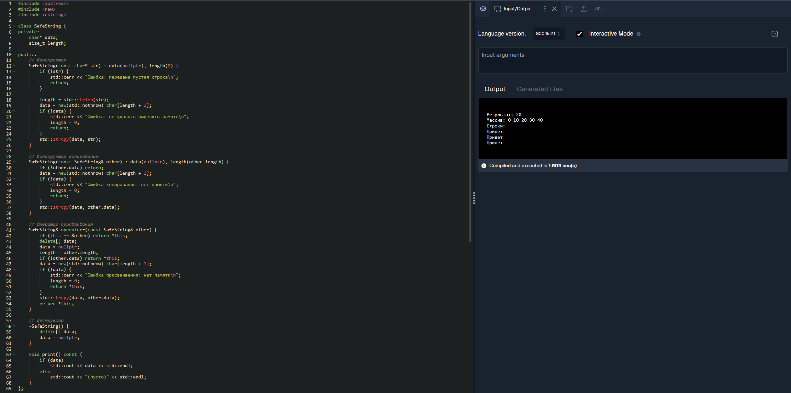|

---

## Задание 3 (Рабочая тетрадь 2)

**Задача:** Напишите программу, которая выполняет вычисления над большим массивом данных. Используйте параллельное выполнение задач (например, с помощью потоков или асинхронного программирования) для оптимизации производительности. Программа должна разделить задачу на несколько частей и выполнить их одновременно.

### Реализация

Для выполнения задания разработана программа на языке **Python**, демонстрирующая преимущества параллельных вычислений на задаче поиска простых чисел.

- Вычисляется количество простых чисел в диапазоне до **5 000 000** (требовательная к процессору задача).
- Реализованы **два подхода**:
  - **Последовательный** – один поток обрабатывает весь диапазон.
  - **Параллельный** – диапазон разбивается на равные части, каждая обрабатывается в отдельном процессе (с помощью `ProcessPoolExecutor`).
- Сравнивается время выполнения, вычисляется **ускорение** (speedup).

Используются только стандартные библиотеки: `concurrent.futures`, `time`, `math`.

---

### Принцип работы

#### 1. Функция `is_prime(n)`
Проверяет, является ли число `n` простым:
- Отсекает `n < 2`, чётные числа.
- Перебирает нечётные делители до `√n`.

#### 2. Функция `count_primes_in_range(start, end)`
Проходит по числам от `start` до `end-1` и суммирует количество простых.

#### 3. Разделение задачи
Общий диапазон `[0, total_limit)` разбивается на `num_workers` равных интервалов.  
Например, для `total_limit = 5_000_000` и `num_workers = 4` получаем интервалы:
- `[0, 1_250_000)`
- `[1_250_000, 2_500_000)`
- `[2_500_000, 3_750_000)`
- `[3_750_000, 5_000_000)`

#### 4. Последовательное выполнение
Вызывается `count_primes_in_range(0, total_limit)` в главном потоке.

#### 5. Параллельное выполнение
- Создаётся пул процессов `ProcessPoolExecutor(max_workers=num_workers)`.
- Каждый интервал отправляется в отдельный процесс через `executor.submit()`.
- Результаты собираются и суммируются.

#### 6. Вывод результатов
- Количество простых чисел (одинаково для обоих способов).
- Затраченное время.
- Ускорение = `время_последовательно / время_параллельно`.

> **Почему процессы, а не потоки?**  
> Из-за GIL (Global Interpreter Lock) в Python потоки не дают реального параллелизма для CPU‑интенсивных задач. `ProcessPoolExecutor` создаёт отдельные процессы, каждый со своим интерпретатором, что позволяет задействовать несколько ядер процессора.


### Листинг кода

Исходный код: [main.py](Prac2/PR2_1/main.py)

```python
import concurrent.futures
import time
import math

def is_prime(n):
    if n < 2: return False
    if n == 2: return True
    if n % 2 == 0: return False
    for i in range(3, int(math.sqrt(n)) + 1, 2):
        if n % i == 0:
            return False
    return True

def count_primes_in_range(start, end):
    count = 0
    for i in range(start, end):
        if is_prime(i):
            count += 1
    return count

def main():
    
    ...
    ...
    ...

if __name__ == "__main__":
    main()
```

### Пример работы

#### Компиляция и запуск (любая ОС с Python 3.6+)
```bash
python main.py
```
#### Скриншоты работы
| Последовательный запуск | Параллельный запуск |
|------------------------|---------------------|
| 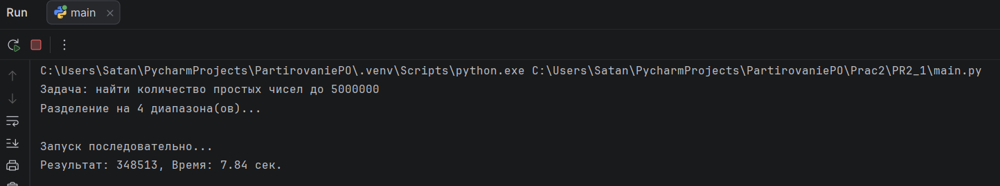 | 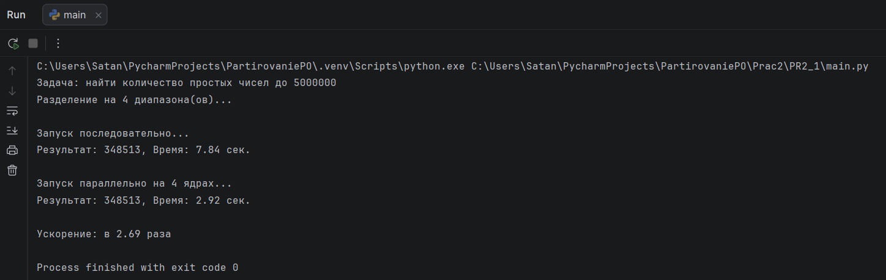 |

---

# Задание 2-3 (Рабочая тетрадь 5)

## Задание 3 (Рабочая тетрадь 5)

**Задача:** Разработайте программу на интерпретируемом языке программирования (например, Python, JavaScript или Ruby), которая будет выполнять простую задачу, такую как обработка текстового файла или вывод данных в графическом интерфейсе.  
Программа должна быть написана таким образом, чтобы она могла работать на любой платформе, где установлен интерпретатор соответствующего языка.
--- 

### Реализация

Для выполнения данного задания было разработано кроссплатформенное приложение на языке Python с графическим интерфейсом на `tkinter`.  
Программа **«Прикол читалка»** (Modern Text Analyzer) позволяет:
- Открыть текстовый файл в формате `.txt`
- Выполнить статистический анализ содержимого:
    - Подсчёт общего количества слов
    - Поиск email-адресов
    - Выделение **50 наиболее часто встречающихся слов** с частотой повторов
- Вывести результаты в двух вкладках:
    - **ОТЧЁТ** – текстовый лог с общей информацией
    - **ЧАСТОТНЫЙ СЛОВАРЬ** – список топ-50 слов в стилизованном виде

Приложение использует только **стандартные библиотеки Python**: `tkinter`, `re`, `threading`, `collections`. Это обеспечивает полную переносимость на любую платформу (Windows, Linux, macOS), где установлен Python 3.6+.

### Скриншоты работы

| Главное окно (вкладка «ОТЧЕТ») | Вкладка «ЧАСТОТНЫЙ СЛОВАРЬ» |
|-------------------------------|-----------------------------|
|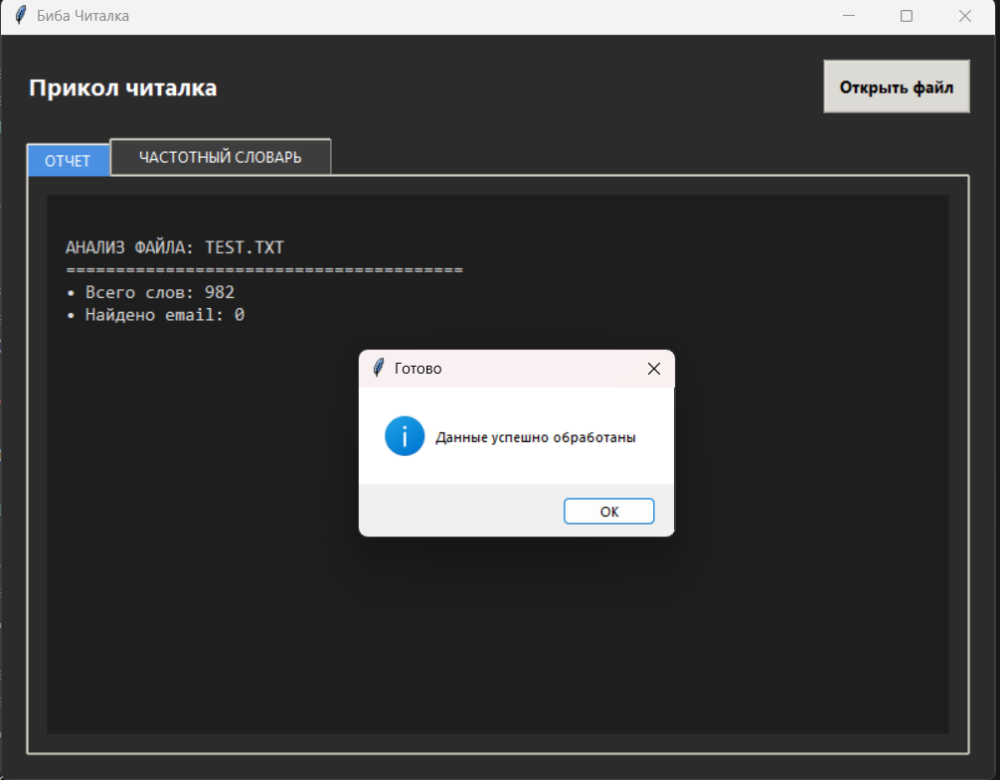 | 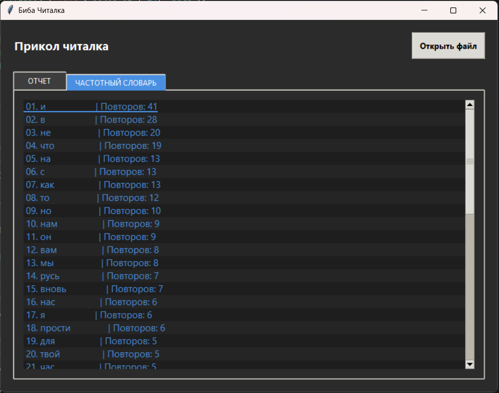|

### Принцип работы

Приложение построено на базе класса `ModernAnalyzer` и работает следующим образом:

1. **Инициализация интерфейса**  
   - Создаётся главное окно с тёмной темой, настраиваются стили `ttk`.  
   - Формируются две вкладки: лог-консоль и список частотных слов.  
   - Внизу окна располагается прогресс-бар.

2. **Выбор файла**  
   - По нажатию кнопки **«Открыть файл»** вызывается диалоговое окно выбора `.txt` файла.

3. **Асинхронная обработка**  
   - Чтение и анализ выполняются в отдельном потоке (`threading.Thread`), чтобы интерфейс не «зависал».  
   - Прогресс-бар обновляется через `root.after()`, что безопасно для многопоточности.

4. **Анализ текста**  
   - Извлечение всех слов: `re.findall(r'\w+', data.lower())`  
   - Поиск email’ов: `re.findall(r'[a-zA-Z0-9._%+-]+@[a-zA-Z0-9.-]+\.[a-zA-Z]{2,}', data)`  
   - Подсчёт частоты слов с помощью `collections.Counter`.  
   - Выбор топ-50 наиболее частотных слов.

5. **Вывод результатов**  
   - В первую вкладку построчно записываются: путь к файлу, количество слов, количество email’ов и пример первого email.  
   - Во второй вкладке формируется нумерованный список слов с количеством повторений. Чётные строки подсвечиваются более тёмным цветом для удобства чтения.

6. **Завершение**  
   - По окончании анализа прогресс-бар заполняется на 100% и появляется всплывающее сообщение «Готово».  
   - Любая ошибка (например, отсутствие файла, проблемы с кодировкой) перехватывается и выводится в `messagebox`.

    
### Листинг кода

Исходный код основного файла: [main.py](Prac5/PR5_1/main.py)

```python
import tkinter as tk
from tkinter import filedialog, messagebox, ttk
import re
import threading
from collections import Counter

class ModernAnalyzer:
    # ... (полный код приведён в приложении)
```

### Пример использования

1. Запустите [main.py](Prac5/PR5_1/main.py).  
2. Нажмите кнопку **«Открыть файл»**.  
3. Выберите любой текстовый файл (например, [test.txt](Prac1/PR1_2/test.txt) с произвольным содержимым).  
4. Дождитесь завершения анализа — прогресс-бар заполнится.  
5. Переключайте вкладки для просмотра отчёта и частотного словаря.  

**Пример содержимого [test.txt](Prac1/PR1_2/test.txt):**
```
На европейские события в 1854 году

 С чего взялась всесветная беда?
 Кто виноват, кто первый начинает?
 Народ вы умный, всякой это знает,
 Да славушка пошла об вас худа!
 Уж лучше бы в покое дома жить
 Да справиться с домашними делами!
 Ведь, кажется, нам нечего делить
 И места много всем под небесами.
 К тому ж и то, коль всё уж поминать:
 10 Смешно французом русского пугать!

 Знакома Русь со всякою бедой!
 Случалось ей, что не бывало с вами.
 Давил ее татарин под пятой,
 А очутился он же под ногами.
 Но далеко она с тех пор ушла!
 Не в мерку ей стать вровень даже с вами;
 Заморский рост она переросла,
 Тянуться ль вам в одно с богатырями!
 Попробуйте на нас теперь взглянуть,
 20 Коль не боитесь голову свихнуть!

```

**Результат во вкладке «ОТЧЁТ»**
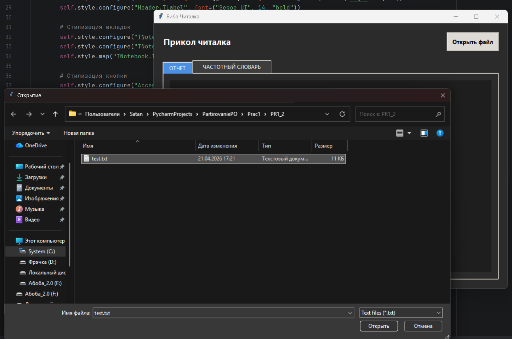


**Результат во вкладке «ЧАСТОТНЫЙ СЛОВАРЬ»**


---

## Задание 2 (Рабочая тетрадь 5)

**Задача:** Разработайте программу, которая будет использовать как переиспользование бинарных файлов, так и переиспользование исходного кода.

Программа должна состоять из двух частей: основной программы (написанной на C или C++) и библиотеки, которая будет использоваться в основной программе.

Библиотека должна быть собрана отдельно и использоваться как бинарный файл на разных платформах.

---
### Реализация

Для выполнения задания разработана программа на языке **C++**, состоящая из:

- **Библиотеки `mylib`**, предоставляющей две функции:
  - `int add(int a, int b)` – сложение двух целых чисел.
  - `void print_message(const char* msg)` – вывод сообщения с префиксом `"Library says: "`.
- **Основной программы `main.cpp`**, которая подключает библиотеку, вызывает её функции и выводит результаты.

Библиотека собрана таким образом, что её можно использовать в двух режимах:
1. **Переиспользование исходного кода** – подключение заголовочного файла `mylib.h` и компиляция вместе с `mylib.cpp`.
2. **Переиспользование бинарных файлов** – предварительная сборка библиотеки в статический (`.a` / `.lib`) или динамический (`.so` / `.dll`) файл, после чего линковка с основной программой без перекомпиляции библиотеки.

Кроссплатформенность обеспечивается макросами `_WIN32` в заголовочном файле (для экспорта/импорта символов в Windows) и универсальным `Makefile`, поддерживающим **Linux**, **macOS** и **Windows (MSYS2/MinGW)**.

### Структура проекта

```
project/
├── mylib/
│   ├── mylib.h        # Заголовочный файл библиотеки (с макросами экспорта)
│   └── mylib.cpp      # Реализация библиотеки
├── main.cpp           # Основная программа, использующая библиотеку
└── Makefile           # Универсальный Makefile для сборки под разные ОС
```
**Папка проекта** [PR5_2](Prac5/PR5_2)

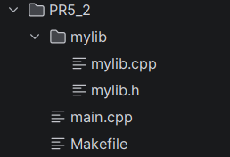

### Сборка и использование

#### Требования

- Компилятор с поддержкой C++11: `g++`, `clang++` или `MinGW` (для Windows).
- Утилита `make` (в Windows можно использовать `mingw32-make`).

#### Сборка статической библиотеки

**Linux / macOS:**
```bash
make static          # создаёт lib/mylib.a
```

**Windows (MinGW):**
```bash
mingw32-make static  # создаёт lib/mylib.a
```

### Сборка динамической библиотеки

**Linux / macOS:**
```bash
make shared          # создаёт lib/mylib.so (или .dylib на macOS)
```

**Windows (MinGW):**
```bash
mingw32-make shared  # создаёт bin/mylib.dll и lib/mylib.dll.a (import library)
```

#### Сборка основной программы

Программа может линковаться **статически** (библиотека встраивается в исполняемый файл) или **динамически** (библиотека загружается во время выполнения).

##### Статическая линковка:
```bash
make main-static     # создаёт main_static
```

##### Динамическая линковка:
```bash
make main-shared     # создаёт main_shared
```

Во втором случае при запуске `main_shared` исполняемый файл должен найти библиотеку:
- На Linux: `export LD_LIBRARY_PATH=./lib:$LD_LIBRARY_PATH && ./main_shared`
- На Windows: скопировать `mylib.dll` в ту же папку, что и `main_shared.exe`.

#### Универсальная цель `all`

```bash
make all             # собирает статическую библиотеку и статически слинкованную программу
make clean           # удаляет все сгенерированные файлы
```

---

## Принцип работы

### 1. Заголовочный файл [mylib.h](Prac5/PR5_2/mylib/mylib.h)

Использует условную компиляцию для определения макроса `MYLIB_API`:

```cpp
#ifdef _WIN32
  #ifdef MYLIB_EXPORTS
    #define MYLIB_API __declspec(dllexport)
  #else
    #define MYLIB_API __declspec(dllimport)
  #endif
#else
  #define MYLIB_API
#endif
```

- При сборке самой библиотеки (`MYLIB_EXPORTS` определён) символы **экспортируются**.
- При использовании библиотеки из программы (`MYLIB_EXPORTS` не определён) символы **импортируются**.
- На платформах, отличных от Windows, макрос пустой (экспорт/импорт не требуется).

#### 2. Реализация [mylib.cpp](Prac5/PR5_2/mylib/mylib.cpp)

Содержит простые функции:
```cpp
int add(int a, int b) { return a + b; }
void print_message(const char* msg) { std::cout << "Library says: " << msg << std::endl; }
```

#### 3. Основная программа [main.cpp](Prac5/PR5_2/main.cpp)

Подключает библиотеку через `#include "mylib/mylib.h"` и вызывает её функции:

```cpp
int result = add(3, 4);
std::cout << "Result: " << result << std::endl;
print_message("Hello from main!");
```

#### 4. Makefile

```makefile
CXX = g++
CXXFLAGS = -Wall -std=c++11 -I.

# Динамическая библиотека
shared: mylib/mylib.cpp
	$(CXX) -fPIC -shared -DMYLIB_EXPORTS $< -o libmylib.so

# Статическая библиотека
static: mylib/mylib.cpp
	$(CXX) -c $< -o mylib.o
	ar rcs libmylib.a mylib.o

# Статическая линковка программы
main-static: main.cpp static
	$(CXX) $< libmylib.a -o main_static

# Динамическая линковка программы
main-shared: main.cpp shared
	$(CXX) $< -L. -lmylib -o main_shared

clean:
	rm -f *.o *.a *.so main_*
```

> Полный [Makefile](Prac5/PR5_2/Makefile) с поддержкой Windows (через условные конструкции) прилагается в проекте.

### Листинг кода

#### [mylib.h](Prac5/PR5_2/mylib/mylib.h) – заголовочный файл библиотеки
```cpp
#ifndef MYLIB_H
#define MYLIB_H

#ifdef _WIN32
  #ifdef MYLIB_EXPORTS
    #define MYLIB_API __declspec(dllexport)
  #else
    #define MYLIB_API __declspec(dllimport)
  #endif
#else
  #define MYLIB_API
#endif

MYLIB_API int add(int a, int b);
MYLIB_API void print_message(const char* msg);

#endif
```

#### [mylib.cpp](Prac5/PR5_2/mylib/mylib.cpp) – реализация библиотеки
```cpp
#include <iostream>
#include "mylib.h"

int add(int a, int b) {
    return a + b;
}

void print_message(const char* msg) {
    std::cout << "Library says: " << msg << std::endl;
}
```

#### [main.cpp](Prac5/PR5_2/main.cpp)– основная программа
```cpp
#include <iostream>
#include "mylib/mylib.h"

int main() {
    int result = add(3, 4);
    std::cout << "Result: " << result << std::endl;

    print_message("Hello from main!");

    return 0;
}
```

### Пример работы

**Команды для Linux:**
```bash
make static               # сборка статической библиотеки
make main-static          # сборка программы со статической линковкой
./main_static
```

**Вывод в консоли:**
```
Result: 7
Library says: Hello from main!
```

**Команды для Windows (MinGW):**
```bash
mingw32-make shared       # сборка mylib.dll
mingw32-make main-shared  # сборка main_shared.exe
# Скопировать mylib.dll в ту же директорию, где находится main_shared.exe
main_shared.exe
```

### Переиспользование бинарных файлов

Если библиотека уже собрана (`libmylib.a` или `libmylib.so` / `mylib.dll`), её можно использовать **без повторной компиляции**:

1. Скопировать заголовочный файл `mylib.h` и бинарный файл библиотеки в другой проект.
2. Подключить заголовок и указать путь к библиотеке при линковке.

**Пример использования статической библиотеки в новом проекте:**
```bash
g++ new_main.cpp -I/path/to/include -L/path/to/lib -lmylib -o new_program
```

**Пример использования динамической библиотеки (Linux):**
```bash
g++ new_main.cpp -I/path/to/include -L/path/to/lib -lmylib -Wl,-rpath,/path/to/lib -o new_program
```
На Windows достаточно поместить `mylib.dll` в папку с исполняемым файлом или в системный PATH.

Таким образом, достигается **переиспользование бинарного кода** без необходимости распространять исходники библиотеки.

---

# Задание 1 (Рабочая тетрадь 6)

**Задача: Напишите программу на языке Python, которая будет выполнять следующие действия:**
```
1. Считывать данные из текстового файла, содержащего список чисел. 
2. Выполнять математические операции (например, суммирование, вычитание, умножение) над этими числами. 
3. Выводить результаты операций в консоль и сохранять их в новый текстовый файл. 
```
**Требования:**
```
• Программа должна быть написана на Python. 
• Используйте стандартные библиотеки Python для работы с файлами и выполнения математических операций. 
• Программа должна быть переносимой, то есть работать на любой платформе, где установлен Python.
```
---
### Реализация:

Для начала был написан код генерирующий достаточно больше количество числовых значений [generator.py](Prac6/PR6_1/generator.py)
Принцип работы которого достаточно прост:

**Данный код генерирует текстовый файл с большим количеством случайных чисел:**
1. Функция `generate_large_file` открывает файл на запись.
2. В цикле (1 000 000 итераций) генерируется случайное вещественное число от -1000 до 1000, округлённое до двух знаков после запятой.
3. Каждое число записывается в строку через пробел.
4. После каждых 10 чисел добавляется перевод строки (для удобочитаемости файла).
5. В итоге создаётся файл [numbers.txt](Prac6/PR6_1/numbers.txt) с миллионом чисел.

После можно было приступить к реализации кода решающего поставленную нам задачу.
Для этого был написан [main.py](Prac6/PR6_1/main.py).
### Принцип работы [main.py](Prac6/PR6_1/main.py) (подробно)

Этот скрипт читает текстовый файл с числами, выполняет **расширенный статистический анализ** и сохраняет отчёт.

#### 1. Подготовка
- Устанавливается **50-значная точность** для десятичных расчётов (модуль `Decimal`), хотя в итоге используется `float` — вероятно, задел на будущее.
- Определена функция `is_prime(n)` — классическая проверка на простоту (отсекает чётные, перебирает нечётные делители до корня).

#### 2. Основная функция `run_comprehensive_analysis(input_path, output_path)`

##### 2.1. Инициализация
- Засекается время выполнения (`time.perf_counter()`).
- Создаётся словарь `metrics` для накопления:
  - `count` – количество чисел, `errors` – ошибок преобразования.
  - `sum`, `min`, `max` – базовые суммы и экстремумы.
  - `mean` и `m2` – для **онлайн-расчёта среднего и дисперсии** (алгоритм Уэлфорда, не хранит все числа).
  - `harmonic_sum` – сумма обратных величин (для гармонического среднего).
  - `primes_count` – счётчик простых чисел.

##### 2.2. Чтение и парсинг файла
- Файл открывается построчно.
- Каждая строка **очищается от мусора**: заменяются запятые, точки с запятой, скобки на пробелы.
- Разбивка на части, попытка преобразовать часть в `float`.

##### 2.3. Накопление метрик (для каждого валидного числа)
- Увеличивается счётчик, корректируются `sum/min/max`.
- **Среднее и дисперсия онлайн**:
  ```python
  delta = val - mean
  mean += delta / count
  delta2 = val - mean
  m2 += delta * delta2
  ```
  В конце `variance = m2 / n`.
- Для гармонического среднего: если число > 0, добавляется `1.0/val`.
- Проверка на **простое число**: если значение целое и `> 0`, вызывается `is_prime()`.

##### 2.4. Формирование отчёта
- Рассчитываются: дисперсия, стандартное отклонение, гармоническое среднее (если сумма обратных величин > 0).
- Вычисляются производные метрики: размах выборки, коэффициент вариации.
- Отчёт выводится на экран и сохраняется в `output_path`.
- Содержит время выполнения, количество обработанных чисел, ошибки, сумму, min/max, среднее арифметическое, дисперсию, среднеквадратичное отклонение, гармоническое среднее, количество простых чисел, размах, коэффициент вариации.

#### 3. Защита от аварийного завершения
- Проверка существования входного файла. Если его нет — создаётся тестовый файл `numbers.txt` с примером данных.
- Обработка исключений на всех уровнях.
- Если нет ни одного валидного числа — программа завершается с сообщением.

#### 4. Точка входа
- Задаются имена `numbers.txt` (вход) и `report.txt` (выход).
- При отсутствии входного файла создаётся демонстрационный файл.
- Вызывается анализ.

---
### Вот какой вывод программы получается на входных данных записаных в файле [numbers.txt](Prac6/PR6_1/numbers.txt): 
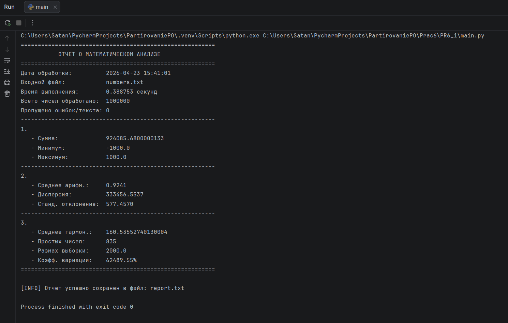

### Помимо этого данный отчет дублируется в качестве .txt файла с названием: [report.txt](Prac6/PR6_1/report.txt).